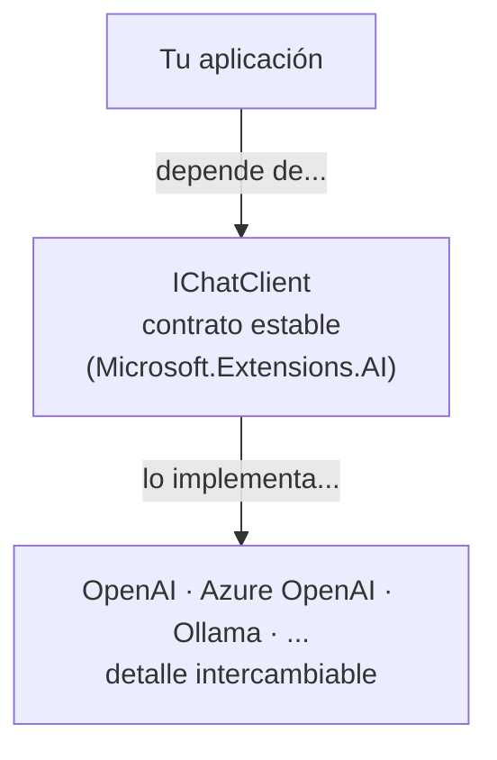
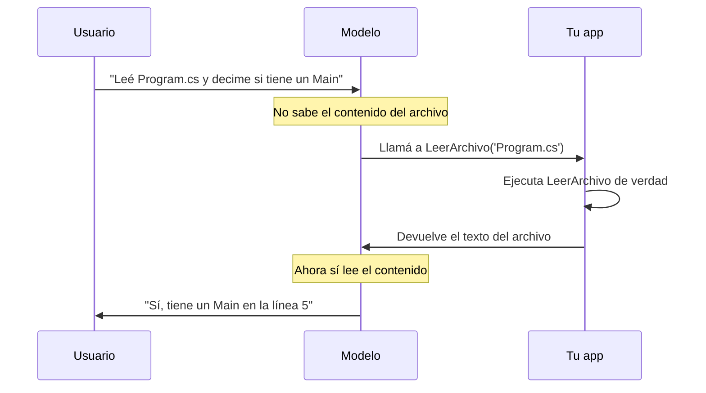
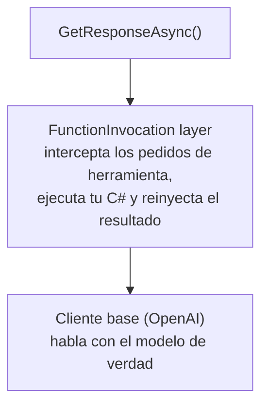

# Microsoft.Extensions.AI: del chat a un asistente con herramientas

> Programación III · Tecnicatura Universitaria en Programación · C# 14 / .NET 10

---

## 1. ¿Qué problema resolvemos?

Antes de meternos con APIs, pensemos qué pasaba **sin** esta librería.

Cada proveedor de modelos (OpenAI, Azure OpenAI, Anthropic, Ollama, etc.) trae su propio SDK con su propia forma de llamar al modelo. Si tu aplicación hablaba directamente con el SDK de OpenAI y mañana querías mover todo a Azure, o probar en local con Ollama, tenías que reescribir cada lugar donde hacías una llamada al modelo.

`Microsoft.Extensions.AI` (de acá en más, **MEAI**) ataca eso con una idea vieja y conocida en .NET: **programar contra una interfaz, no contra una implementación concreta**. Es exactamente el mismo principio que ya usás con `ILogger`, `IConfiguration` o `DbContext`: tu código depende de un contrato estable, y quién lo implementa lo decidís en un solo lugar.

La interfaz central se llama `IChatClient`. Tu aplicación habla con `IChatClient`. Quién está atrás —OpenAI, Ollama, lo que sea— es un detalle que vive en una sola línea de configuración.



Esto te da tres cosas concretas:

1. **Portabilidad**: cambiás de proveedor tocando una línea.
2. **Testeabilidad**: podés inyectar un `IChatClient` falso en los tests.
3. **Composición**: podés envolver el cliente con capas (logging, caché, telemetría, invocación de funciones) sin tocar tu lógica.

---

## 2. Los tipos que tenés que conocer

MEAI es chico de vocabulario. Con cuatro o cinco tipos te movés en el 90% de los casos.

| Tipo           | Para qué sirve                                                        |
|:---------------|:----------------------------------------------------------------------|
| `IChatClient`  | El cliente. Le mandás mensajes, te devuelve respuestas.               |
| `ChatMessage`  | Un mensaje individual de la conversación.                             |
| `ChatRole`     | Quién habla: `System`, `User`, `Assistant`, `Tool`.                   |
| `ChatResponse` | La respuesta completa del modelo. Su propiedad `.Text` trae el texto. |
| `ChatOptions`  | Opciones de la llamada: modelo, temperatura, herramientas, etc.       |

Un punto importante sobre los **roles**, porque es la base de todo lo que sigue:

- **System**: instrucciones de comportamiento. "Sos un asistente que responde en español y de forma concisa." Lo escribís vos, el usuario no lo ve.
- **User**: lo que escribe la persona.
- **Assistant**: lo que respondió el modelo en turnos anteriores.
- **Tool**: el resultado de ejecutar una herramienta (lo vemos en la parte 3).

El modelo **no tiene memoria propia**. Cada vez que lo llamás, le mandás toda la conversación de nuevo. Esto te va a parecer raro al principio, pero es clave: la "memoria" del chat es simplemente una lista de `ChatMessage` que vos mantenés y le reenviás.

---

## 3. Instalación

Necesitás dos paquetes para el caso típico (acá uso OpenAI como proveedor, pero el patrón es idéntico para los demás):

```bash
dotnet add package Microsoft.Extensions.AI
dotnet add package Microsoft.Extensions.AI.OpenAI
```

- `Microsoft.Extensions.AI`: las abstracciones (`IChatClient`, etc.) **más** las utilidades de alto nivel (invocación de funciones, caché, telemetría).
- `Microsoft.Extensions.AI.OpenAI`: el adaptador concreto que convierte el SDK de OpenAI en un `IChatClient`.

> Con esos dos paquetes alcanza para **todos** los proveedores que usamos en este apunte (OpenAI, Gemini, Groq, Ollama, OpenRouter), porque todos exponen un endpoint compatible con OpenAI. Lo vemos en detalle en la sección 6.

---

## 4. La llamada más simple posible (una sola pregunta)

Empecemos por lo mínimo: mandar un texto, recibir un texto. Sin conversación, sin herramientas.

```csharp
using Microsoft.Extensions.AI;
using OpenAI.Chat;

// 1. Creamos el cliente concreto del proveedor...
// 2. ...y lo convertimos a IChatClient con AsIChatClient().
IChatClient client =
    new ChatClient(
        model: "gpt-5.4-mini",
        apiKey: Environment.GetEnvironmentVariable("OPENAI_API_KEY"))
    .AsIChatClient();

// 3. Mandamos un único texto y leemos la respuesta.
ChatResponse respuesta = await client.GetResponseAsync("¿Qué es la recursividad?");

Console.WriteLine(respuesta.Text);
```

Fijate en la secuencia de tres pasos:

1. **`new ChatClient(...)`** crea el cliente nativo de OpenAI. La API key la sacamos de una variable de entorno (nunca la quemes en el código).
2. **`.AsIChatClient()`** es el método de extensión clave: toma ese cliente nativo y lo "viste" como un `IChatClient`. A partir de acá, tu código ya no sabe que atrás hay OpenAI.
3. **`GetResponseAsync("...")`** tiene una sobrecarga cómoda que acepta un `string` suelto. Por debajo, lo arma como un único `ChatMessage` con rol `User`.

### Encapsulando en una función reutilizable

En la práctica no vas a tener el cliente suelto en `Main`. Lo razonable es envolverlo en una función (o un método de un servicio). Acá una versión que recibe una pregunta y un mensaje de sistema opcional:

```csharp
public class AsistenteSimple {
    private readonly IChatClient client;

    public AsistenteSimple(IChatClient client) {
        this.client = client;
    }

    public async Task<string> PreguntarAsync(string pregunta, string? sistema = null) {
        // Armamos la lista de mensajes a mano para tener control del rol System.
        List<ChatMessage> mensajes = [];

        if (sistema is not null) {
            mensajes.Add(new ChatMessage(ChatRole.System, sistema));
        }

        mensajes.Add(new ChatMessage(ChatRole.User, pregunta));

        ChatResponse respuesta = await this.client.GetResponseAsync(mensajes);
        return respuesta.Text;
    }
}
```

Uso:

```csharp
var asistente = new AsistenteSimple(client);

string r = await asistente.PreguntarAsync(
    pregunta: "Explicá qué es un puntero, en una oración.",
    sistema: "Respondés en español rioplatense, breve y sin rodeos.");

Console.WriteLine(r);
```

¿Por qué pasar de la versión de una línea a esta? Porque ahora `AsistenteSimple` depende de `IChatClient` por constructor. Eso es **inyección de dependencias** lista para usar: en producción le pasás el cliente real, en los tests le pasás uno falso, y la clase ni se entera.

### Manteniendo una conversación

Si querés varios turnos, la idea es la que adelantamos: el historial es una lista que vos vas acumulando.

```csharp
List<ChatMessage> historial = [
    new(ChatRole.System, "Sos un tutor de programación paciente.")
];

while (true) {
    Console.Write("Vos: ");
    string? entrada = Console.ReadLine();
    if (string.IsNullOrWhiteSpace(entrada)) break;

    historial.Add(new ChatMessage(ChatRole.User, entrada));

    ChatResponse respuesta = await client.GetResponseAsync(historial);
    Console.WriteLine($"IA: {respuesta.Text}");

    // Clave: agregamos la respuesta al historial para el próximo turno.
    historial.AddMessages(respuesta);
}
```

El método `AddMessages(respuesta)` agrega los mensajes que generó el modelo de vuelta a la lista. Así, en la siguiente vuelta, el modelo "recuerda" lo que ya dijo... porque se lo estás reenviando entero.

---

## 5. Herramientas (tools): que el modelo haga cosas, no solo hable

Hasta acá el modelo solo produce texto. Pero un **asistente de programación** de verdad necesita *actuar*: leer un archivo, escribir otro, listar un directorio. Eso se logra con **herramientas** (en inglés, *tools* o *function calling*).

### La idea de fondo

El modelo **no ejecuta tu código**. Lo que hace es distinto y más sutil:

1. Vos le describís qué funciones existen (nombre, qué hace, qué parámetros recibe).
2. El modelo, si le conviene para responder, en vez de contestar con texto, contesta: *"quiero llamar a `LeerArchivo` con `ruta = 'Program.cs'`"*.
3. **Tu programa** ejecuta esa función de verdad y le devuelve el resultado al modelo.
4. El modelo recibe el resultado y sigue (puede contestar, o pedir otra herramienta).



Lo bueno de MEAI: ese ida y vuelta (pasos 2 a 4), que es tedioso de programar a mano, **lo automatiza** por vos con un componente de la pipeline. Vos solo escribís las funciones normales de C#.

### Paso 1: escribir las herramientas como funciones C# normales

Son métodos comunes y corrientes. La única diferencia es que les ponés `[Description]` para que el modelo entienda qué hacen. Esas descripciones **son parte del prompt**: cuanto más claras, mejor decide el modelo.

```csharp
using System.ComponentModel;

public static class HerramientasArchivos {
    // Acotamos todo a una carpeta de trabajo para no dejar que el modelo
    // toque cualquier cosa del disco. Esto es una decisión de seguridad.
    private static readonly string RaizTrabajo =
        Path.Combine(Directory.GetCurrentDirectory(), "workspace");

    [Description("Lee el contenido de texto de un archivo dentro del workspace y lo devuelve.")]
    public static string LeerArchivo(
        [Description("Ruta relativa del archivo, por ejemplo 'src/Program.cs'.")] string ruta) {
        string completa = ResolverRutaSegura(ruta);

        if (!File.Exists(completa)) {
            return $"ERROR: el archivo '{ruta}' no existe.";
        }

        return File.ReadAllText(completa);
    }

    [Description("Escribe (crea o sobrescribe) un archivo de texto dentro del workspace.")]
    public static string EscribirArchivo(
        [Description("Ruta relativa del archivo a escribir.")] string ruta,
        [Description("Contenido completo que se va a guardar en el archivo.")] string contenido) {
        string completa = ResolverRutaSegura(ruta);

        Directory.CreateDirectory(Path.GetDirectoryName(completa)!);
        File.WriteAllText(completa, contenido);

        return $"OK: se escribieron {contenido.Length} caracteres en '{ruta}'.";
    }

    [Description("Lista los archivos y carpetas del workspace.")]
    public static string ListarArchivos() {
        var entradas = Directory
            .EnumerateFileSystemEntries(RaizTrabajo, "*", SearchOption.AllDirectories)
            .Select(p => Path.GetRelativePath(RaizTrabajo, p));

        return string.Join("\n", entradas);
    }

    // Evita que una ruta tipo "../../algo" se escape del workspace.
    private static string ResolverRutaSegura(string ruta) {
        string completa = Path.GetFullPath(Path.Combine(RaizTrabajo, ruta));

        if (!completa.StartsWith(RaizTrabajo, StringComparison.Ordinal)) {
            throw new InvalidOperationException("Ruta fuera del workspace.");
        }

        return completa;
    }
}
```

Tres detalles pedagógicos importantes acá:

- **Las descripciones son para el modelo, no para vos.** Pensalas como documentación que el modelo lee para decidir cuándo y cómo usar cada función. Una descripción floja = un modelo que usa mal la herramienta.
- **Devolvemos `string` siempre, incluso los errores.** El modelo necesita poder leer qué pasó. Si la función tira una excepción cruda, mejor devolver un mensaje de error legible que el modelo pueda interpretar y reintentar.
- **`ResolverRutaSegura` no es opcional.** Le estás dando a un modelo la capacidad de escribir en el disco. Acotalo siempre a un sandbox. Un asistente que puede escribir en cualquier lado es un agujero de seguridad.

### Paso 2: registrar la invocación automática de funciones

Acá entra la **pipeline** de MEAI. Recordá que `IChatClient` se puede envolver en capas. Para que el ida y vuelta de herramientas sea automático, agregamos la capa `UseFunctionInvocation()` con el `ChatClientBuilder`:

```csharp
using Microsoft.Extensions.AI;
using OpenAI.Chat;

IChatClient baseClient =
    new ChatClient("gpt-5.4-mini", Environment.GetEnvironmentVariable("OPENAI_API_KEY"))
    .AsIChatClient();

// Envolvemos el cliente base con la capa que ejecuta las funciones por nosotros.
IChatClient client = new ChatClientBuilder(baseClient)
    .UseFunctionInvocation()
    .Build();
```

Visualmente, la pipeline quedó así:



### Paso 3: declarar las herramientas y llamar

Convertimos cada método en un `AIFunction` con `AIFunctionFactory.Create`, y los pasamos por `ChatOptions.Tools`:

```csharp
ChatOptions opciones = new() {
    Tools =
    [
        AIFunctionFactory.Create(HerramientasArchivos.LeerArchivo),
        AIFunctionFactory.Create(HerramientasArchivos.EscribirArchivo),
        AIFunctionFactory.Create(HerramientasArchivos.ListarArchivos),
    ]
};

List<ChatMessage> historial =
[
    new(ChatRole.System,
        """
        Sos un asistente de programación. Trabajás sobre los archivos del workspace.
        Cuando el usuario te pida ver, crear o modificar código, usá las herramientas
        disponibles en lugar de inventar el contenido. Respondés en español.
        """)
];

historial.Add(new ChatMessage(ChatRole.User,
    "Creá un archivo Saludo.cs con una clase que tenga un método que imprima 'Hola'."));

ChatResponse respuesta = await client.GetResponseAsync(historial, opciones);

Console.WriteLine(respuesta.Text);
```

Cuando corras esto, internamente puede pasar lo siguiente sin que vos escribas una línea más:

1. El modelo decide que necesita `EscribirArchivo`.
2. La capa `UseFunctionInvocation` ejecuta tu método `EscribirArchivo`, que crea el archivo de verdad.
3. El resultado (`"OK: se escribieron ..."`) vuelve al modelo.
4. El modelo te responde algo como *"Listo, creé `Saludo.cs` con la clase `Saludo`."*

Todo ese baile ocurre **dentro** de la única llamada a `GetResponseAsync`. Eso es lo que la capa te ahorra.

### El bucle de conversación completo del asistente

Juntando todo, un asistente de programación interactivo se ve así:

```csharp
Directory.CreateDirectory(
    Path.Combine(Directory.GetCurrentDirectory(), "workspace"));

while (true) {
    Console.Write("\nVos: ");
    string? entrada = Console.ReadLine();
    if (string.IsNullOrWhiteSpace(entrada)) break;

    historial.Add(new ChatMessage(ChatRole.User, entrada));

    ChatResponse respuesta = await client.GetResponseAsync(historial, opciones);

    Console.WriteLine($"\nAsistente: {respuesta.Text}");
    historial.AddMessages(respuesta);
}
```

Probá pedirle cosas como:

- *"Listá los archivos del proyecto."*
- *"Leé Saludo.cs y agregale un comentario explicando qué hace."*
- *"Creá un archivo README.md con una descripción del workspace."*

En cada caso el modelo elige solo qué herramienta usar, tu programa la ejecuta, y el resultado se reintegra a la conversación.

---

## 6. Una factory para elegir el proveedor

Acá se ve el pago de toda la abstracción. **Nada de lo que escribimos en las secciones 4 y 5 cambia.** Tu clase `AsistenteSimple`, tus `HerramientasArchivos`, tu `ChatOptions`, tu bucle de conversación: todo queda igual, porque todo depende de `IChatClient`. Lo único que cambia es **cómo construís el cliente base**.

La clave que nos permite unificar todos los proveedores en un solo lugar es esta: OpenAI, Gemini, Groq, Ollama y OpenRouter exponen todos un endpoint **compatible con el protocolo de OpenAI** (`/v1/chat/completions`). Entonces, en vez de usar un SDK distinto por cada uno, usamos el **mismo** paquete `Microsoft.Extensions.AI.OpenAI` y solo le cambiamos tres datos: la URL base, el nombre del modelo y de dónde sacar la API key.

### Paso 1: un `record` que describe a cada proveedor

Empezamos modelando "qué necesito saber de un proveedor" como un dato. Son exactamente esos tres campos (más la key, que puede faltar en el caso local de Ollama):

```csharp
public record Proveedor(string Endpoint, string Modelo, string? VariableApiKey = null) {
    public static Proveedor Crear(string proveedor) => proveedor.ToLower() switch {
     // "openai"     => new("https://api.openai.com/v1/chat/completions",                               "gpt-5.4-mini",     "OPENAI_API_KEY"),
        "openai"     => new("https://api.openai.com/v1/chat/completions",                               "gpt-5.5",          "OPENAI_API_KEY"),
        "gemini"     => new("https://generativelanguage.googleapis.com/v1beta/openai/chat/completions", "gemini-2.5-flash", "GEMINI_API_KEY"),
        "groq"       => new("https://api.groq.com/openai/v1/chat/completions",                          "qwen/qwen3.6-27b", "GROQ_API_KEY"),
        "ollama"     => new("http://localhost:11434/v1/chat/completions",                               "qwen2.5-coder:7b"),
        "openrouter" => new("https://openrouter.ai/api/v1/chat/completions",                            "openrouter/auto",  "OPENROUTER_API_KEY"),
        _ => throw new InvalidOperationException($"Proveedor desconocido '{proveedor}'.")
    };
}
```

Fijate en un par de cosas pedagógicas:

- Usamos un `switch expression` sobre el string normalizado a minúsculas. Es la forma idiomática en C# moderno de mapear un valor a una configuración, sin una pila de `if/else`.
- **Ollama no tiene `VariableApiKey`** (queda en `null`): corre local y no pide credencial. Modelamos esa diferencia en el tipo, no con un `if` suelto más adelante.
- El `_` (descarte) cubre el caso de un proveedor mal escrito y falla rápido con un mensaje claro. Mejor explotar al arrancar que mandar requests a un endpoint inexistente.

### Paso 2: convertir un `Proveedor` en un `IChatClient`

Ahora la fábrica de verdad. Recibe el nombre del proveedor, resuelve su configuración y arma el `IChatClient`. El detalle fino está en el endpoint: el SDK de OpenAI espera la **URL base** (hasta `/v1`) y él solito le agrega `/chat/completions`. Como nuestros datos vienen con la ruta completa, se la recortamos.

```csharp
using System.ClientModel;
using Microsoft.Extensions.AI;
using OpenAI;
using OpenAI.Chat;

public static class FabricaChatClient {
    public static IChatClient Crear(string nombreProveedor) {
        Proveedor p = Proveedor.Crear(nombreProveedor);

        // El SDK agrega "/chat/completions" por su cuenta: le pasamos solo la base.
        string baseUrl = p.Endpoint.Replace("/chat/completions", "");

        // Si el proveedor no necesita key (Ollama), mandamos una ignorada;
        // si la necesita, la leemos de la variable de entorno y validamos que exista.
        string apiKey = p.VariableApiKey is null
            ? "no-requiere-key"
            : Environment.GetEnvironmentVariable(p.VariableApiKey)
                ?? throw new InvalidOperationException(
                    $"Falta la variable de entorno '{p.VariableApiKey}'.");

        OpenAIClientOptions opciones = new() {
            Endpoint = new Uri(baseUrl)
        };

        return new OpenAIClient(new ApiKeyCredential(apiKey), opciones)
            .GetChatClient(p.Modelo)
            .AsIChatClient();
    }
}
```

### Paso 3: usarla

Ahora elegir proveedor es una sola línea, y absolutamente todo lo demás del apunte sigue funcionando sin tocarse:

```csharp
// Cambiás solo este string para saltar de un proveedor a otro.
IChatClient baseClient = FabricaChatClient.Crear("gemini");

// El resto es idéntico a las secciones 4 y 5.
IChatClient client = new ChatClientBuilder(baseClient)
    .UseFunctionInvocation()
    .Build();

ChatResponse respuesta = await client.GetResponseAsync("¿Qué es la recursividad?");
Console.WriteLine(respuesta.Text);
```

Una mejora típica es no quemar el string: leerlo de la configuración o de una variable de entorno, así cambiás de proveedor sin recompilar.

```csharp
string proveedor = Environment.GetEnvironmentVariable("IA_PROVEEDOR") ?? "ollama";
IChatClient baseClient = FabricaChatClient.Crear(proveedor);
```

### Qué proveedor conviene para qué

| Proveedor    | Modelo del ejemplo | Necesita key | Bueno para...                                     |
|:-------------|:-------------------|:------------:|:--------------------------------------------------|
| `openai`     | `gpt-5.5`          | Sí           | Calidad alta y *function calling* sólido.         |
| `gemini`     | `gemini-2.5-flash` | Sí           | Buen costo/rendimiento, contexto grande.          |
| `groq`       | `qwen/qwen3.6-27b` | Sí           | Inferencia muy rápida sobre modelos abiertos.     |
| `ollama`     | `qwen2.5-coder:7b` | No (local)   | Gratis, privado, ideal para la cátedra.           |
| `openrouter` | `openrouter/auto`  | Sí           | Un único endpoint que rutea a decenas de modelos. |

Para que Ollama funcione, primero hay que tenerlo corriendo y haber bajado el modelo:

```bash
ollama pull qwen2.5-coder:7b
ollama serve   # levanta el servidor local en http://localhost:11434
```

Un detalle honesto para los alumnos: que todos hablen `IChatClient` no garantiza que todos soporten **lo mismo**. El *function calling* de la sección 5 depende de que el modelo concreto sepa pedir herramientas. Los modelos grandes de OpenAI, Gemini y Groq lo hacen bien; con Ollama elegí un modelo que las soporte (`qwen2.5-coder` y `llama3.1`, por ejemplo, sí). La abstracción te unifica la *API*, no las *capacidades* del modelo.

> **Sobre los nombres de modelo:** los identificadores de este ejemplo (`gpt-5.5`, `qwen/qwen3.6-27b`, etc.) son los que cargaste vos. Cambian seguido; antes de dar la clase conviene verificar el nombre exacto vigente en la documentación de cada proveedor, porque un modelo dado de baja hace fallar la llamada con un 404.

---

## 7. Por qué esto importa (y dónde seguir)

Lo que armamos es, en esencia, **el corazón de un agente**: un modelo + un conjunto de herramientas que son métodos reales de tu sistema. La frase para recordar es:

> Las herramientas del agente **son** los métodos de tu dominio.

Si en lugar de leer/escribir archivos esas funciones fueran `BuscarCliente`, `CrearPedido` o `ConsultarStock` (los métodos de un repositorio), tendrías un agente que opera sobre tu base de datos. El mecanismo es idéntico; solo cambian las funciones que registrás en `ChatOptions.Tools`.

Algunas capas más de la pipeline que vale la pena conocer cuando avancen:

| Capa                      | Qué agrega                                                |
|:--------------------------|:----------------------------------------------------------|
| `UseFunctionInvocation()` | Ejecuta tus herramientas automáticamente (la que usamos). |
| `UseDistributedCache()`   | Cachea respuestas para no repetir llamadas idénticas.     |
| `UseOpenTelemetry()`      | Trazas y métricas de cada llamada al modelo.              |
| `UseLogging()`            | Loguea cada request/response a un `ILogger`.              |

Todas se encadenan en el `ChatClientBuilder` igual que `UseFunctionInvocation`, y todas operan sin que tu lógica de negocio se entere. Es el mismo patrón de middleware que ya conocés de ASP.NET Core, aplicado a las llamadas al modelo.

---

## 8. Resumen en una carilla

- MEAI te da `IChatClient`, una **interfaz estable** para hablar con cualquier proveedor.
- Pasás del SDK concreto a `IChatClient` con `.AsIChatClient()`.
- Una llamada simple: `await client.GetResponseAsync("texto")` → `respuesta.Text`.
- El modelo **no tiene memoria**: el historial es una `List<ChatMessage>` que vos mantenés y reenviás.
- Los **roles** (`System`, `User`, `Assistant`, `Tool`) estructuran la conversación.
- Las **herramientas** son métodos C# normales con `[Description]`, registrados con `AIFunctionFactory.Create` en `ChatOptions.Tools`.
- `UseFunctionInvocation()` automatiza el ciclo pedido-de-herramienta → ejecución → resultado.
- **Cambiar de proveedor** (OpenAI, Gemini, Groq, Ollama, OpenRouter) se reduce a un string en una factory, porque todos hablan el protocolo compatible con OpenAI. La abstracción unifica la API, no las capacidades del modelo.
- Acotá siempre lo que las herramientas pueden hacer (sandbox). Darle al modelo acceso al disco sin límites es peligroso.

---

*UTN · Facultad Regional Tucumán · Tecnicatura Universitaria en Programación · Programación III*
