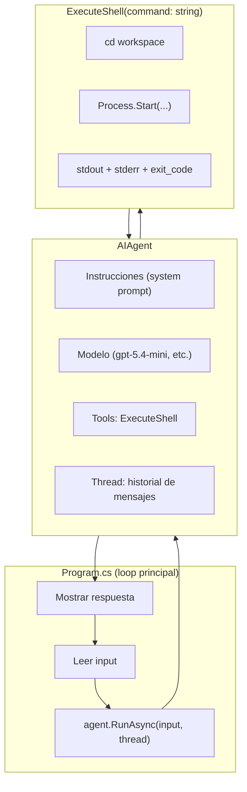

# Construyendo un agente con shell en C#

## Microsoft Agent Framework + OpenAI

> C# 14 / .NET 10 / Microsoft.Agents.AI 1.0

---

## ¿Qué vamos a construir?

Una app de consola en C# que replica el comportamiento de un agente tipo "Nano": vos le pedís algo en lenguaje natural, y el agente decide cuándo ejecutar comandos de shell en tu máquina para cumplir la tarea. Mantiene contexto entre turnos y trabaja sobre un directorio específico (el workspace).

Es, en esencia, un *mini* Claude Code / Codex / Cursor CLI. Entender cómo se arma esto por dentro te da una ventaja enorme: dejás de ver a los agentes como magia y empezás a verlos como lo que son — un loop bien orquestado entre un LLM y un conjunto de herramientas.

El objetivo no es solo que termines con este programa funcionando, sino que entiendas **por qué cada pieza está donde está**, para que después puedas armar agentes distintos: uno que administre tu calendario, otro que analice logs, otro que consulte tu base de datos, etc.

---

## Parte 1 — Primeros principios

Antes de tocar Visual Studio, necesitás tener claros cinco conceptos. Si te los saltás, vas a terminar copiando código sin entender qué hace.

### 1.1 — Un LLM por sí solo no hace nada

Un modelo de lenguaje (GPT, Claude, Gemini, lo que sea) es una función pura: le mandás texto, te devuelve texto. No tiene memoria, no tiene archivos, no tiene red, no puede ejecutar nada. Es literalmente un *stateless text transformer*.

Entonces, ¿cómo hace ChatGPT para "recordar" lo que le dijiste hace 5 mensajes? Le mandan **todos los mensajes anteriores** en cada request. La "memoria" vive fuera del modelo, en el cliente.

Y ¿cómo hace para "ejecutar código" o "buscar en internet"? No lo hace. Lo que hace es **pedir** que ejecutemos algo por él, y nosotros le devolvemos el resultado como si fuera más texto.

Eso es todo. Un agente es un loop alrededor de esta idea.

### 1.2 — El loop del agente

Todo agente, por sofisticado que parezca, es este loop:

```
1. Usuario escribe algo
2. Cliente manda al LLM: historial + mensaje nuevo + lista de herramientas disponibles
3. LLM responde una de dos cosas:
   a) Texto final para el usuario → mostramos y volvemos al paso 1
   b) "Quiero llamar a la herramienta X con argumentos Y"
4. Si es (b): ejecutamos X(Y), agregamos el resultado al historial, volvemos al paso 2
```

Ese paso 4 es la magia. El LLM no ejecuta nada — solo *pide* que ejecutemos algo. Nosotros (el código C#) decidimos si le hacemos caso, cómo, y qué le devolvemos.

### 1.3 — Tool calling (la gramática del pedido)

Para que el modelo pueda "pedir" que ejecutemos algo, necesita dos cosas:

1. **Saber qué herramientas existen.** Le pasamos una lista con nombre, descripción y schema de parámetros de cada función. Esto va en cada request.
2. **Una forma estructurada de pedir.** Los modelos modernos devuelven un JSON con el nombre de la función y los argumentos cuando quieren invocarla, en lugar de texto plano.

OpenAI formalizó esto como *function calling*. Hoy es estándar.

### 1.4 — Por qué usar un framework

Podrías implementar todo esto a mano con `HttpClient` y la API REST de OpenAI. Serían unas 300 líneas de JSON parsing, manejo del loop, serialización de schemas, reintentos, streaming. Lo hicimos durante un tiempo. Es tedioso y repetitivo.

**Microsoft Agent Framework** (MAF) es la abstracción que te evita escribir ese plumbing. Te da:

- `AIAgent`: representa al agente, con sus instrucciones y herramientas.
- `AgentThread`: maneja el historial de la conversación.
- `AIFunctionFactory`: convierte cualquier método C# en una herramienta con su schema JSON autogenerado por reflexión.
- Un runner interno que ejecuta el loop 1-2-3-4 por vos.

MAF llegó a 1.0 en abril de 2026, reemplazando a Semantic Kernel y AutoGen como la recomendación oficial de Microsoft. Viene incluido en .NET 10.

### 1.5 — Por qué la shell como herramienta

Nuestro agente va a tener **una sola herramienta**: ejecutar un comando de shell.

Parece trampa — y en cierto sentido lo es. Una shell es una meta-herramienta: con `ls`, `cat`, `grep`, `sed`, `dotnet`, `git`, etc., el agente tiene acceso a todo el sistema. No necesitás darle 50 herramientas distintas; le das shell y listo.

Esta es la filosofía de Claude Code y Codex CLI. Es también el motivo por el cual son *peligrosos* si no se ejecutan en un directorio acotado: si le das `rm -rf` como opción, tarde o temprano lo va a usar mal.

Por eso vamos a restringirlo a un workspace. La decisión de diseño: **un agente con pocas herramientas poderosas es más flexible y más simple que uno con muchas herramientas específicas**, pero requiere más cuidado con los límites.

---

## Parte 2 — Preparación del proyecto

### 2.1 — Requisitos

- .NET 10 SDK instalado (`dotnet --version` debería mostrar 10.x).
- Una API key de OpenAI. La conseguís en https://platform.openai.com/api-keys.
- Un editor: VS Code, Visual Studio 2026 o Rider.

### 2.2 — Crear el proyecto

Abrí una terminal en el directorio donde quieras el proyecto y:

```bash
dotnet new console -n NanoAgent -f net10.0
cd NanoAgent
```

### 2.3 — Agregar los paquetes NuGet

Necesitás tres paquetes:

```bash
dotnet add package Microsoft.Agents.AI --prerelease
dotnet add package Microsoft.Agents.AI.OpenAI --prerelease
dotnet add package Microsoft.Extensions.AI
```

> **Nota**: al momento de escribir esto, los paquetes `Microsoft.Agents.AI.*` pueden seguir marcándose como prerelease en NuGet aunque la librería esté en 1.0. Si te da error, sacá el `--prerelease` y probá.

Revisá tu `NanoAgent.csproj`. Debería verse así:

```xml
<Project Sdk="Microsoft.NET.Sdk">
  <PropertyGroup>
    <OutputType>Exe</OutputType>
    <TargetFramework>net10.0</TargetFramework>
    <Nullable>enable</Nullable>
    <ImplicitUsings>enable</ImplicitUsings>
    <LangVersion>latest</LangVersion>
  </PropertyGroup>
  <ItemGroup>
    <PackageReference Include="Microsoft.Agents.AI" Version="1.0.*" />
    <PackageReference Include="Microsoft.Agents.AI.OpenAI" Version="1.0.*" />
    <PackageReference Include="Microsoft.Extensions.AI" Version="9.*" />
  </ItemGroup>
</Project>
```

### 2.4 — Configurar la API key

**No hardcodeés la API key en el código.** Nunca. Usá una variable de entorno:

**Linux/macOS** (`~/.bashrc` o `~/.zshrc`):
```bash
export OPENAI_API_KEY="sk-..."
```

**Windows** (PowerShell como admin, persistente):
```powershell
[System.Environment]::SetEnvironmentVariable("OPENAI_API_KEY", "sk-...", "User")
```

Cerrá y reabrí la terminal para que tome la variable.

> **Regla de oro**: si subís una API key a GitHub, aunque sea un segundo, consideralá comprometida y revocala. Los bots escanean el repo en segundos.

---

## Parte 3 — Arquitectura del agente

Antes de escribir una línea, dibujemos el programa.



Tres piezas. Una sola herramienta. Un solo loop.

### Decisiones de diseño que vale la pena hacer explícitas

| Decisión                                        | Por qué                                                                                                              |
| ----------------------------------------------- | -------------------------------------------------------------------------------------------------------------------- |
| Workspace fijo al directorio del ejecutable     | Evita que el agente toque archivos fuera de ese scope. Mitigación simple, efectiva.                                  |
| Una sola tool `ExecuteShell`                    | Menos código, más flexible. El LLM ya sabe usar shell.                                                               |
| Devolver stdout + stderr + exit_code juntos     | El modelo necesita los tres para decidir qué hacer después (reintentar, ajustar, etc.).                              |
| Thread gestionado por MAF (no lo serializamos)  | Para una app interactiva simple, la memoria en proceso alcanza. Si querés persistencia, se puede serializar después. |
| Instrucciones del sistema en un archivo externo | Así las podés editar sin recompilar. Mismo principio que tu archivo de prompt en Python.                             |
| Modelo configurable por constante               | Fácil de cambiar entre `gpt-5.4-mini`, `gpt-5.4`, etc. según costo/calidad.                                          |

---

## Parte 4 — Código, pieza por pieza

Vamos a armar `Program.cs` incrementalmente. Al final tenés el archivo completo.

### 4.1 — Imports y constantes

```csharp
using System.ClientModel;
using System.ComponentModel;
using System.Diagnostics;
using System.Text;
using Microsoft.Agents.AI;
using Microsoft.Extensions.AI;
using OpenAI;

// --- Configuración ---
const string Model = "gpt-5.4-mini";
const string AgentName = "Nano";

string workspace = AppContext.BaseDirectory;
string promptFile = Path.Combine(workspace, "AGENTS.md");

string apiKey = Environment.GetEnvironmentVariable("OPENAI_API_KEY")
    ?? throw new InvalidOperationException(
        "Definí la variable de entorno OPENAI_API_KEY");
```

**Qué está pasando:**

- `AppContext.BaseDirectory` te da el directorio donde está corriendo el ejecutable. Es nuestro "workspace" — el sandbox donde el agente puede operar.
- Leemos la API key de la variable de entorno. Si no está, fallamos *temprano y ruidosamente*. Esto es un patrón importante: errores de configuración deben explotar al arrancar, no a los 10 minutos cuando el usuario haga algo.
- El modelo lo ponemos como constante. Mañana querés probar `gpt-5.4`, cambiás una línea.

### 4.2 — Las instrucciones del sistema

Las instrucciones (el "system prompt") son el ADN del agente. Definen quién es, qué puede hacer, qué estilo tiene, qué restricciones respeta.

```csharp
static string BuildInstructions(string workspace, string promptFile) {
    string baseRules = $"""
        Reglas operativas:
        - Trabajás en {workspace}.
        - Antes de modificar, leé archivos relevantes.
        - Usá la herramienta ExecuteShell para leer, escribir y ejecutar.
        - No inventes resultados: si no sabés algo, ejecutá un comando para averiguarlo.
        - Respondé corto y en español.
        """;

    if (File.Exists(promptFile)) {
        string header = File.ReadAllText(promptFile)
            .Replace("{workspace}", workspace)
            .Trim();
        return $"{header}\n\n{baseRules}";
    }

    return baseRules;
}
```

**Por qué este diseño:**

- Hay dos niveles: un header opcional editable (desde `AGENTS.md`) y reglas base siempre presentes. El header sirve para personalizar la "personalidad" del agente sin tocar el código; las reglas base son el contrato operativo que no queremos perder.
- Usamos *raw string literals* (`"""..."""`, C# 11+) que respetan los saltos de línea y evitan el infierno de concatenaciones.
- El placeholder `{workspace}` lo reemplazamos manualmente. No usamos string interpolation dentro del archivo porque los archivos de texto no tienen interpolación — se reemplaza en tiempo de lectura.
- El nombre `AGENTS.md` no es casual: se está convirtiendo en una convención de facto en la industria (Cursor, Claude Code, Codex lo usan) para dejar instrucciones al agente que trabaja en un repositorio. Si ponés este agente en un proyecto que ya tiene un `AGENTS.md`, lo va a respetar automáticamente.

> **Primer principio oculto**: las instrucciones son código. Tratalas como código. Versionalas. Probá cambios. Si cambiás el system prompt y el agente empieza a comportarse raro, es tu "bug".

### 4.3 — La herramienta: ExecuteShell

Acá está el corazón del asunto. Queremos una función C# que:

1. Reciba un comando como string.
2. Lo ejecute en el workspace.
3. Devuelva stdout, stderr y exit code como un único string estructurado.

```csharp
[Description("Ejecuta un comando de shell en el workspace y devuelve su salida (stdout, stderr y exit code). Usala para listar archivos, leer contenido, correr programas, etc.")]
static string ExecuteShell(
    [Description("El comando exacto a ejecutar, tal como lo tipearías en una terminal.")]
    string command) {
    // En Windows usamos cmd.exe, en Unix bash
    bool isWindows = OperatingSystem.IsWindows();
    string shell = isWindows ? "cmd.exe" : "/bin/bash";
    string flag = isWindows ? "/c" : "-c";

    var psi = new ProcessStartInfo {
        FileName = shell,
        Arguments = $"{flag} \"{command.Replace("\"", "\\\"")}\"",
        WorkingDirectory = workspace,
        RedirectStandardOutput = true,
        RedirectStandardError = true,
        UseShellExecute = false,
        CreateNoWindow = true,
        StandardOutputEncoding = Encoding.UTF8,
        StandardErrorEncoding = Encoding.UTF8,
    };

    try {
        using var proc = Process.Start(psi)
            ?? throw new InvalidOperationException("No se pudo iniciar el proceso.");

        string stdout = proc.StandardOutput.ReadToEnd();
        string stderr = proc.StandardError.ReadToEnd();
        proc.WaitForExit();

        return $"""
            exit_code: {proc.ExitCode}
            --- stdout ---
            {Truncate(stdout, 4000)}
            --- stderr ---
            {Truncate(stderr, 2000)}
            """;
    } catch (Exception ex) {
        return $"ERROR al ejecutar: {ex.Message}";
    }
}

static string Truncate(string s, int max) =>
    s.Length <= max ? s : s[..max] + $"\n[... truncado, {s.Length - max} caracteres más ...]";
```

**Puntos importantes (prestá atención, acá hay varios)**:

1. **`[Description(...)]`**. Este atributo es crítico. MAF lo lee con reflexión y lo incluye en el schema JSON que le manda al LLM. Esa descripción es lo que el modelo ve cuando decide si llamar esta función. Mala descripción → el modelo no sabe cuándo usarla. La descripción del parámetro también viaja al modelo.

2. **Workspace como directorio de trabajo del proceso**. `WorkingDirectory = workspace` hace que cualquier ruta relativa que use el comando se resuelva desde ahí. El agente puede hacer `cat mifile.txt` sin saber la ruta absoluta.

3. **Windows vs Unix**. Detectamos el SO y usamos la shell nativa. `cmd.exe /c "..."` en Windows, `/bin/bash -c "..."` en Linux/macOS. Esto ya hace tu agente multiplataforma.

4. **Truncado de la salida**. Un `ls -R /` podría devolver megabytes. Si mandás todo eso al modelo, (a) explota la ventana de contexto, (b) te sale carísimo. Truncamos a ~4KB stdout, ~2KB stderr, y le avisamos al modelo que truncamos. *Design decision: mejor un resultado truncado con aviso que un crash o una factura de USD 300.*

5. **Manejo de errores devuelto como string**, no como excepción. ¿Por qué? Porque si lanzás una excepción, MAF la propaga y el loop se rompe. Si devolvés un string "ERROR: ...", el modelo lo lee y puede reaccionar (probar otra cosa, reportarle al usuario, etc.). Los agentes deben manejar errores "conversacionalmente".

6. **`using var proc`**. `Process` implementa `IDisposable`. Sin `using` vas a tener process handles colgados — bug clásico.

> **Un comentario pedagógico**: este método son 40 líneas. En Python con `subprocess.run` serían 5. C# es más verboso acá porque `Process.Start` está diseñado para casos generales, no para "correr un comando y leer su salida". La verbosidad vale la pena porque ganás control fino sobre timeouts, encoding, streaming, etc. — cosas que un alumno avanzado va a necesitar.

### 4.4 — Crear el agente

```csharp
// 1. Cliente de OpenAI
var openAIClient = new OpenAIClient(new ApiKeyCredential(apiKey));

// 2. Chat client apuntado a un modelo específico
var chatClient = openAIClient.GetChatClient(Model);

// 3. Convertir nuestro método en un AIFunction (tool)
var shellTool = AIFunctionFactory.Create(ExecuteShell);

// 4. Armar el agente
AIAgent agent = chatClient.CreateAIAgent(
    instructions: BuildInstructions(workspace, promptFile),
    name: AgentName,
    tools: [shellTool]
);

// 5. Crear el thread (historial de la conversación)
AgentThread thread = agent.GetNewThread();
```

Esto son 5 líneas reales de configuración. Mirá lo que cada una significa:

- **`OpenAIClient`** (del SDK oficial de OpenAI). Cliente HTTP base hacia api.openai.com.
- **`GetChatClient(Model)`**. Te da un cliente específico que apunta a ese modelo via la Chat Completions API. MAF soporta tres estilos: Chat Completions (el más simple, más universal), Responses (más rico), Assistants (estado en el servidor). Nosotros usamos Chat Completions porque es el más directo y portable — el mismo código funciona con Azure OpenAI, Ollama local, o cualquier endpoint compatible con OpenAI.
- **`AIFunctionFactory.Create(ExecuteShell)`**. Introspecciona el método con reflexión: lee el nombre, los parámetros, sus tipos, las anotaciones `[Description]`, y genera un `AIFunction` con todo el schema JSON que el LLM va a ver. Esto es lo que te ahorra escribir el schema a mano.
- **`CreateAIAgent(...)`**. Extension method que empaqueta chat client + instrucciones + tools en un `AIAgent`.
- **`GetNewThread()`**. Crea un hilo de conversación vacío. El thread es donde vive la memoria de esta sesión.

### 4.5 — El loop principal (REPL)

```csharp
Console.WriteLine($"Agente '{AgentName}' listo en {workspace}");
Console.WriteLine("Escribí 'salir' para terminar.\n");

while (true) {
    Console.Write("Vos> ");
    string? input = Console.ReadLine()?.Trim();

    if (string.IsNullOrEmpty(input))
        continue;

    if (input.Equals("salir", StringComparison.OrdinalIgnoreCase) ||
        input.Equals("exit", StringComparison.OrdinalIgnoreCase))
        break;

    try {
        AgentRunResponse response = await agent.RunAsync(input, thread);
        Console.WriteLine($"\nAgente> {response.Text}\n");
    } catch (Exception ex) {
        Console.WriteLine($"\n[ERROR] {ex.Message}\n");
    }
}

Console.WriteLine("Chau.");
```

**Qué observar:**

- `agent.RunAsync(input, thread)` es *toda* la lógica del loop 1-2-3-4 de la sección 1.2. Adentro, MAF:
  1. Agrega el input al thread.
  2. Manda el thread entero (+ instrucciones + tools) a OpenAI.
  3. Si la respuesta pide llamar a una tool, ejecuta `ExecuteShell` con los args que el modelo pidió.
  4. Mete el resultado en el thread.
  5. Vuelve a llamar al modelo.
  6. Repite hasta que el modelo no pida más tools y devuelva texto final.
  7. Devuelve ese texto.
- Puede hacer varias idas y vueltas en una sola `RunAsync`. Si vos pedís "listá los .cs y resumí el más grande", el agente puede llamar `ExecuteShell("ls *.cs")`, después `ExecuteShell("wc -l *.cs | sort")`, después `ExecuteShell("cat big.cs")`, y recién ahí respondernos. Todo eso pasa dentro de un `RunAsync`.
- El `try/catch` externo te protege de errores de red, rate limits, etc. Sin él, un hipo del modelo mata tu programa.

---

## Parte 5 — El archivo completo

Acá va `Program.cs` entero, listo para copiar y pegar:

```csharp
using System.ClientModel;
using System.ComponentModel;
using System.Diagnostics;
using System.Text;
using Microsoft.Agents.AI;
using Microsoft.Extensions.AI;
using OpenAI;

// ─── Configuración ────────────────────────────────────────────
const string Model = "gpt-5.4-mini";
const string AgentName = "Nano";

string workspace = AppContext.BaseDirectory;
string promptFile = Path.Combine(workspace, "AGENTS.md");

string apiKey = Environment.GetEnvironmentVariable("OPENAI_API_KEY")
    ?? throw new InvalidOperationException(
        "Definí la variable de entorno OPENAI_API_KEY");

// ─── Herramienta: ejecutar shell ──────────────────────────────
[Description("Ejecuta un comando de shell en el workspace y devuelve su salida (stdout, stderr y exit code). Usala para listar archivos, leer contenido, correr programas, etc.")]
string ExecuteShell(
    [Description("El comando exacto a ejecutar, tal como lo tipearías en una terminal.")]
    string command) {
    bool isWindows = OperatingSystem.IsWindows();
    string shell = isWindows ? "cmd.exe" : "/bin/bash";
    string flag = isWindows ? "/c" : "-c";

    var psi = new ProcessStartInfo {
        FileName = shell,
        Arguments = $"{flag} \"{command.Replace("\"", "\\\"")}\"",
        WorkingDirectory = workspace,
        RedirectStandardOutput = true,
        RedirectStandardError = true,
        UseShellExecute = false,
        CreateNoWindow = true,
        StandardOutputEncoding = Encoding.UTF8,
        StandardErrorEncoding = Encoding.UTF8,
    };

    try {
        using var proc = Process.Start(psi)
            ?? throw new InvalidOperationException("No se pudo iniciar el proceso.");

        string stdout = proc.StandardOutput.ReadToEnd();
        string stderr = proc.StandardError.ReadToEnd();
        proc.WaitForExit();

        return $"""
            exit_code: {proc.ExitCode}
            --- stdout ---
            {Truncate(stdout, 4000)}
            --- stderr ---
            {Truncate(stderr, 2000)}
            """;
    } catch (Exception ex) {
        return $"ERROR al ejecutar: {ex.Message}";
    }
}

static string Truncate(string s, int max) =>
    s.Length <= max ? s : s[..max] + $"\n[... truncado, {s.Length - max} caracteres más ...]";

// ─── Instrucciones del sistema ────────────────────────────────
static string BuildInstructions(string workspace, string promptFile) {
    string baseRules = $"""
        Reglas operativas:
        - Trabajás en {workspace}.
        - Antes de modificar, leé archivos relevantes.
        - Usá la herramienta ExecuteShell para leer, escribir y ejecutar.
        - No inventes resultados: si no sabés algo, ejecutá un comando para averiguarlo.
        - Respondé corto y en español.
        """;

    if (File.Exists(promptFile)) {
        string header = File.ReadAllText(promptFile)
            .Replace("{workspace}", workspace)
            .Trim();
        return $"{header}\n\n{baseRules}";
    }

    return baseRules;
}

// ─── Creación del agente ──────────────────────────────────────
var openAIClient = new OpenAIClient(new ApiKeyCredential(apiKey));
var chatClient = openAIClient.GetChatClient(Model);
var shellTool = AIFunctionFactory.Create(ExecuteShell);

AIAgent agent = chatClient.CreateAIAgent(
    instructions: BuildInstructions(workspace, promptFile),
    name: AgentName,
    tools: [shellTool]
);

AgentThread thread = agent.GetNewThread();

// ─── Loop REPL ────────────────────────────────────────────────
Console.WriteLine($"Agente '{AgentName}' listo en {workspace}");
Console.WriteLine("Escribí 'salir' para terminar.\n");

while (true) {
    Console.Write("Vos> ");
    string? input = Console.ReadLine()?.Trim();

    if (string.IsNullOrEmpty(input))
        continue;

    if (input.Equals("salir", StringComparison.OrdinalIgnoreCase) ||
        input.Equals("exit", StringComparison.OrdinalIgnoreCase))
        break;

    try {
        AgentRunResponse response = await agent.RunAsync(input, thread);
        Console.WriteLine($"\nAgente> {response.Text}\n");
    } catch (Exception ex) {
        Console.WriteLine($"\n[ERROR] {ex.Message}\n");
    }
}

Console.WriteLine("Chau.");
```

> **Nota sobre top-level statements**: estoy usando funciones locales (`ExecuteShell`, `Truncate`) dentro de `Program.cs` con top-level statements. Esto funciona en .NET 10 sin problemas. Si preferís estructurarlo con clases, movelas a una clase `Tools` estática — queda más ordenado para proyectos más grandes.

---

## Parte 6 — Probarlo

1. Compilá: `dotnet build`
2. Corré: `dotnet run`
3. Probá cosas como:

```
Vos> listá los archivos del directorio
Vos> ¿cuántas líneas tiene Program.cs?
Vos> creá un archivo llamado hola.txt con el texto "Hola UTN"
Vos> leé hola.txt y decime qué dice
Vos> borrá hola.txt
```

Vas a ver cómo el agente *decide* cuándo llamar `ExecuteShell` y cuándo responder directamente. Preguntale "¿cuánto es 2+2?" y no debería ejecutar nada — el modelo sabe sumar. Preguntale "¿qué archivos .cs hay acá?" y vas a verlo ejecutar `ls *.cs` o `dir *.cs`.

### Ejercicio mental

Antes de seguir, preguntate: **¿cómo sabe el agente cuándo usar la herramienta?**

La respuesta: no "sabe" en el sentido humano. Recibió un schema JSON que describe la tool y su descripción ("Ejecuta un comando de shell..."). Cuando procesa tu pedido, el modelo calcula que es más probable producir una llamada a esa función que producir texto directo. Es estadística, no razonamiento — pero con modelos grandes la estadística se parece sospechosamente a razonamiento.

Si cambiás la descripción de la tool a "usala solo cuando el usuario diga la palabra PLIM", el agente va a cambiar su comportamiento. Probalo. Es instructivo.

---

## Parte 7 — Decisiones de diseño aplicables a otros agentes

Hasta acá tenés una app funcionando. Ahora viene lo importante: **los principios transferibles**. Estos son los que deberías llevarte a cualquier agente que construyas en el futuro.

### 7.1 — Granularidad de las herramientas

Una tool poderosa (shell) o muchas tools específicas (`ListFiles`, `ReadFile`, `WriteFile`, `DeleteFile`, `RunCommand`, ...). ¿Cuándo conviene cada una?

- **Poderosa y pocas**: cuando el dominio es abierto y el modelo es bueno (GPT-4 y superiores). El modelo improvisa. Más flexible, menos código.
- **Específicas y muchas**: cuando hay reglas de negocio que querés hacer cumplir *desde el código*. Ejemplo: un agente bancario no debería tener `ExecuteSQL` — debería tener `TransferirEntre(cuentaOrigen, cuentaDestino, monto)` que valida permisos, límites diarios, antifraude, y recién ahí toca la base. La herramienta *es* el control.

Regla: **cuanto más sensible la operación, más específica la tool**.

### 7.2 — Descripciones: el 80/20 del éxito

La diferencia entre un agente que funciona y uno que no suele estar en las descripciones de las tools y en el system prompt. No en el código.

Probá esto: con tu `ExecuteShell` funcionando, cambiá la descripción a simplemente `"Ejecuta comandos."`. Vas a ver que el agente se vuelve menos confiable — a veces la llama cuando no corresponde, a veces no la llama cuando sí.

Las descripciones de tools no son comentarios decorativos. Son *parte del contrato con el modelo*. Tratalas con el mismo cuidado que tratás un endpoint de tu API.

### 7.3 — Errores como datos, no como excepciones

Regla general para agentes: **devolvé los errores como texto que el modelo pueda leer**. No lances excepciones que rompan el loop.

¿Por qué? Porque los modelos son buenísimos para reaccionar a errores. Si `ExecuteShell` devuelve `"exit_code: 1, stderr: file not found"`, el agente muy probablemente va a probar otra cosa — listar el directorio, chequear el nombre, preguntarte. Si en cambio lanzás una excepción, el loop muere y el usuario ve un stack trace.

Este patrón va más allá de los agentes. Es una forma de pensar: *¿qué información necesita quien me llama para recuperarse de este error?*

### 7.4 — Contexto acotado

Cada token que mandás al modelo cuesta plata. Y la ventana de contexto, aunque sea de 128K tokens, no es infinita. Dos mitigaciones básicas:

1. **Truncá los outputs largos.** Como hicimos con el shell. Si un comando devuelve 1 MB, mandarle todo eso al modelo es desperdicio.
2. **Considerá estrategias de memoria a largo plazo.** Si la conversación se alarga, podés resumir turnos viejos, guardar hechos importantes en una base, o empezar threads nuevos. MAF deja serializar threads (`AgentThread.SerializeAsync`) para persistirlos, pero la estrategia de gestión es tuya.

### 7.5 — El workspace como sandbox

Nuestro agente puede ejecutar `rm -rf .` dentro del workspace. Podría borrarte todo el proyecto. ¿Cómo mitigamos?

Opciones, de menos a más seguro:

1. **Confiar en el usuario**: solo ponés el agente en un workspace que podés perder (ej: un git repo que podés resetear). Lo que hicimos.
2. **Blacklist de comandos**: antes de ejecutar, chequeás que el comando no contenga `rm -rf`, `dd`, `format`, etc. Frágil.
3. **Aprobación humana**: antes de cada comando, mostrás al usuario qué va a ejecutar y esperás confirmación. Es lo que hace Claude Code.
4. **Contenedor/VM**: corrés el agente adentro de un container sin red y con un volumen efímero. Máxima seguridad, más infra.

Para un ejercicio de clase, (1) alcanza. Para producción, casi siempre querés (3) o (4).

### 7.6 — El system prompt es infraestructura

El system prompt no es "un texto que le decís al modelo". Es la *configuración* del agente. Como cualquier config:

- Versionalo (commitealo a git).
- Probá cambios (un prompt distinto puede romper tests que antes pasaban).
- Documentá por qué cada línea está ahí.

El archivo externo `AGENTS.md` que propusimos es una forma simple de empezar. En proyectos más serios vas a querer templating, variantes por entorno (dev/prod), A/B testing de prompts, etc.

---

## Cierre

Lo que acabamos de construir son ~100 líneas de C#. Hace dos años, armar algo con esta capacidad te llevaba una semana y mil líneas de plumbing. Ese es el valor de frameworks como Microsoft Agent Framework: bajan la barrera de entrada.

Pero — y este es el punto pedagógico que me importa — la baja barrera de entrada es un riesgo si no entendés los primeros principios. Un alumno que copia y pega código con un framework puede tener un agente funcionando sin entender qué es un tool call, qué es un thread, por qué la descripción importa, o por qué el error debe volver como dato. Cuando el agente falle (y va a fallar), no va a saber qué tocar.

Por eso este tutorial gasta más tiempo en el *por qué* que en el *cómo*. El cómo lo podés mirar en la documentación de Microsoft cuando lo necesites. El por qué es lo que te hace ingeniero.
