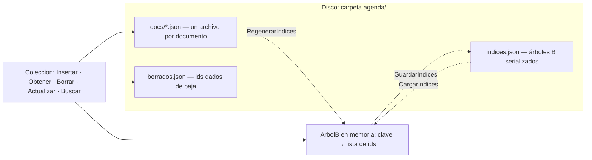

# Tutorial: una mini base de datos NoSQL documental

Las bases de datos documentales (como MongoDB o CouchDB) guardan la información en **documentos** —objetos JSON sin esquema fijo— en lugar de filas y tablas. En este tutorial vamos a construir una versión mínima en C#, en **un único archivo**, para entender las piezas que hacen funcionar a una base de datos real:

- Cada documento se guarda como **un archivo JSON independiente**.
- Las búsquedas usan **índices implementados con árboles B**.
- El **borrado es perezoso** (*lazy*): borrar solo anota el id como eliminado; el archivo se elimina después, al compactar.
- La **actualización es una baja seguida de un alta**: nunca modificamos nada "en el lugar".
- Los índices se pueden **guardar en JSON, recuperar o regenerar** a partir de los documentos.

Al final tendremos un demo por consola que ejercita todas las operaciones.

> Este tutorial usa [serialización JSON](./02.220-Json.md) y retoma la idea de persistir colecciones que vimos en [serialización y repositorio](./02.230-Serializacion-repositorio.md).

## Idea general

La base de datos tiene tres piezas en disco y una en memoria:



Los **documentos son la fuente de verdad**: si los índices se pierden o se corrompen, siempre se pueden regenerar leyendo los archivos. Los índices son solo una estructura auxiliar para buscar rápido.

Después de correr el demo, la carpeta queda así:

```text
agenda/
├── borrados.json          ← ids marcados como borrados (tombstones)
├── indices.json           ← los árboles B, serializados
└── docs/
    ├── 06b3f6d7.json      ← un documento
    ├── 09bbeebd.json      ← otro documento
    └── ...
```

Y cada documento es simplemente un objeto JSON con su `id`:

```json
{
  "nombre": "Ana Paredes",
  "telefono": "381-5551001",
  "ciudad": "Tucuman",
  "id": "06b3f6d7"
}
```

## El árbol B: el índice ordenado

Para buscar `ciudad = "Cordoba"` sin recorrer todos los archivos necesitamos un índice: una estructura que mapea *valor del campo → ids de los documentos que lo tienen*.

Podríamos usar un `Dictionary`, pero elegimos un **árbol B** porque es la estructura que usan las bases de datos reales, y por dos buenas razones:

1. **Mantiene las claves ordenadas**, lo que permite búsquedas por rango ("nombres entre B y E"), algo imposible con una tabla hash.
2. **Es un árbol balanceado de nodos anchos**: cada nodo guarda varias claves, así el árbol queda muy bajo y encontrar una clave requiere visitar pocos nodos. En una base real cada nodo es una página de disco, y menos nodos significa menos lecturas.

Usamos el **grado mínimo `T = 2`**: cada nodo guarda entre 1 y 3 claves (entre `T-1` y `2T-1`). Con nodos tan chicos el árbol se divide seguido y es fácil de observar; en una base real `T` sería de cientos.

### El nodo

```csharp
class NodoB {
    public List<string> Claves { get; set; } = new();
    public List<List<string>> Ids { get; set; } = new();   // ids por clave (admite repetidas)
    public List<NodoB> Hijos { get; set; } = new();

    [JsonIgnore]
    public bool EsHoja => Hijos.Count == 0;
}
```

Cada clave lleva asociada una **lista de ids**, porque varios documentos pueden compartir el mismo valor (tres contactos en Córdoba). Un nodo interno con `n` claves tiene `n + 1` hijos: `Hijos[i]` contiene las claves menores que `Claves[i]`, y el último hijo las mayores que todas.

Usamos propiedades públicas (y no campos) a propósito: así `JsonSerializer` puede guardar y recuperar el nodo sin ninguna configuración extra. `[JsonIgnore]` evita serializar `EsHoja`, que es un valor calculado.

### Buscar

La pregunta que más se repite en un árbol B es "¿en qué posición de este nodo va esta clave?". La extraemos a un método auxiliar que van a compartir la búsqueda y la inserción:

```csharp
static int Posicion(NodoB nodo, string clave) {
    int i = 0;
    while (i < nodo.Claves.Count && string.CompareOrdinal(clave, nodo.Claves[i]) > 0) i++;
    return i;
}
```

Devuelve la posición de la primera clave mayor o igual a la buscada; si todas son menores, devuelve `Claves.Count`, que es justo el índice del último hijo.

Con eso, la búsqueda baja por el árbol: si la clave está en el nodo, listo; si no, desciende al hijo correspondiente.

```csharp
public List<string> Buscar(string clave) {
    var nodo = Raiz;
    while (true) {
        int i = Posicion(nodo, clave);
        if (i < nodo.Claves.Count && clave == nodo.Claves[i]) return nodo.Ids[i];
        if (nodo.EsHoja) return new();
        nodo = nodo.Hijos[i];
    }
}
```

Usamos `string.CompareOrdinal` para que el orden sea siempre el mismo sin importar la configuración regional. (Por eso el demo evita acentos en los datos: con orden ordinal, `"Á"` no queda junto a `"A"`.)

### Insertar

La inserción usa el algoritmo clásico: **si al bajar encontramos un nodo lleno, lo dividimos antes de entrar**. Así, cuando llegamos a la hoja siempre hay lugar. El único caso aparte es la raíz: si está llena, el árbol crece hacia arriba.

```csharp
public void Insertar(string clave, string id) {
    if (Raiz.Claves.Count == 2 * T - 1) {      // raíz llena: el árbol crece hacia arriba
        var nueva = new NodoB();
        nueva.Hijos.Add(Raiz);
        DividirHijo(nueva, 0);
        Raiz = nueva;
    }
    var nodo = Raiz;
    while (true) {
        int i = Posicion(nodo, clave);
        if (i < nodo.Claves.Count && clave == nodo.Claves[i]) {
            nodo.Ids[i].Add(id);               // clave repetida: acumulamos el id
            return;
        }
        if (nodo.EsHoja) {
            nodo.Claves.Insert(i, clave);
            nodo.Ids.Insert(i, new() { id });
            return;
        }
        if (nodo.Hijos[i].Claves.Count == 2 * T - 1)
            DividirHijo(nodo, i);              // subió una clave: re-evaluar en este nodo
        else
            nodo = nodo.Hijos[i];
    }
}
```

El cuerpo del bucle hace siempre las mismas tres preguntas, en orden:

1. ¿La clave ya está en este nodo? → acumular el id y terminar.
2. ¿Es una hoja? → insertar acá y terminar.
3. ¿El hijo al que hay que bajar está lleno? → dividirlo y **volver a empezar en el mismo nodo**; si no, bajar.

El truco está en el paso 3. Al dividir, una clave nueva sube al nodo actual, y habría que analizar cómo se compara con la buscada: ¿es igual (acumular el id)? ¿es menor (bajar a la derecha)? ¿es mayor (bajar a la izquierda)? En lugar de tratar cada caso a mano, la siguiente vuelta del bucle los resuelve con las mismas tres preguntas de siempre. Sin casos especiales: solo re-evaluar.

Dividir un nodo lleno significa: la clave del medio **sube al padre**, y la mitad derecha pasa a un nodo nuevo.

```csharp
void DividirHijo(NodoB padre, int i) {
    var lleno = padre.Hijos[i];
    var derecho = new NodoB();

    // la clave del medio sube al padre
    padre.Claves.Insert(i, lleno.Claves[T - 1]);
    padre.Ids.Insert(i, lleno.Ids[T - 1]);
    padre.Hijos.Insert(i + 1, derecho);

    // la mitad derecha pasa al nodo nuevo
    derecho.Claves.AddRange(lleno.Claves.GetRange(T, T - 1));
    derecho.Ids.AddRange(lleno.Ids.GetRange(T, T - 1));
    lleno.Claves.RemoveRange(T - 1, T);
    lleno.Ids.RemoveRange(T - 1, T);

    if (!lleno.EsHoja) {
        derecho.Hijos.AddRange(lleno.Hijos.GetRange(T, T));
        lleno.Hijos.RemoveRange(T, T);
    }
}
```

Este es todo el costo de mantener el árbol balanceado: el árbol nunca se "tuerce" porque solo crece hacia arriba, cuando se divide la raíz.

### Recorrer en orden y buscar por rango

Como las claves están ordenadas, un recorrido *en orden* (hijo izquierdo, clave, hijo derecho) las entrega de menor a mayor. Sobre ese recorrido, la búsqueda por rango es un simple filtro:

```csharp
public IEnumerable<(string Clave, List<string> Ids)> EnOrden() => EnOrden(Raiz);

static IEnumerable<(string, List<string>)> EnOrden(NodoB nodo) {
    for (int i = 0; i < nodo.Claves.Count; i++) {
        if (!nodo.EsHoja)
            foreach (var par in EnOrden(nodo.Hijos[i])) yield return par;
        yield return (nodo.Claves[i], nodo.Ids[i]);
    }
    if (!nodo.EsHoja)
        foreach (var par in EnOrden(nodo.Hijos[^1])) yield return par;
}

public IEnumerable<(string Clave, List<string> Ids)> Rango(string desde, string hasta) =>
    EnOrden().Where(p => string.CompareOrdinal(p.Clave, desde) >= 0
                      && string.CompareOrdinal(p.Clave, hasta) <= 0);
```

> Para mantener el código simple, `Rango` recorre todo el árbol y filtra. Una versión optimizada podaría las ramas fuera del rango; queda propuesto como ejercicio.

## La colección: documentos + índices + borrado perezoso

`Coleccion` es la clase que une todo. Recibe la carpeta donde vive y la lista de campos a indexar:

```csharp
class Coleccion {
    readonly string carpeta;
    string CarpetaDocs     => Path.Combine(carpeta, "docs");
    string ArchivoIndices  => Path.Combine(carpeta, "indices.json");
    string ArchivoBorrados => Path.Combine(carpeta, "borrados.json");
    string RutaDoc(string id) => Path.Combine(CarpetaDocs, id + ".json");

    Dictionary<string, ArbolB> indices = new();   // campo indexado -> árbol B
    HashSet<string> borrados = new();             // ids dados de baja (tombstones)

    static readonly JsonSerializerOptions Opciones = new() { WriteIndented = true };

    public Coleccion(string carpeta, params string[] camposIndexados) {
        this.carpeta = carpeta;
        Directory.CreateDirectory(CarpetaDocs);
        foreach (var campo in camposIndexados) indices[campo] = new ArbolB();
        if (File.Exists(ArchivoBorrados))
            borrados = JsonSerializer.Deserialize<HashSet<string>>(File.ReadAllText(ArchivoBorrados))!;
        if (!CargarIndices()) RegenerarIndices();
    }
```

El constructor ya muestra la política de arranque: **si hay índices guardados los carga; si no, los regenera** leyendo los documentos.

Los documentos son `JsonObject` (de `System.Text.Json.Nodes`): objetos JSON dinámicos, sin esquema. Eso es lo que hace "NoSQL" a la base: dos documentos de la misma colección pueden tener campos distintos.

### Alta

```csharp
public string Insertar(JsonObject doc) {
    string id = Guid.NewGuid().ToString("N")[..8];
    doc["id"] = id;
    File.WriteAllText(RutaDoc(id), doc.ToJsonString(Opciones));
    Indexar(doc, id);
    return id;
}

void Indexar(JsonObject doc, string id) {
    foreach (var (campo, arbol) in indices)
        if (doc[campo] is JsonNode valor)
            arbol.Insertar(valor.ToString(), id);
}
```

El alta hace exactamente dos cosas: escribe el archivo `docs/<id>.json` y agrega el id a cada índice cuyo campo esté presente en el documento. Si un documento no tiene el campo indexado, simplemente no aparece en ese índice.

### Lectura por id

```csharp
public JsonObject? Obtener(string id) {
    if (borrados.Contains(id) || !File.Exists(RutaDoc(id))) return null;
    return JsonNode.Parse(File.ReadAllText(RutaDoc(id)))!.AsObject();
}
```

Acá aparece por primera vez el borrado perezoso: un id anotado en `borrados` se comporta como inexistente, **aunque su archivo siga en disco**.

### Baja perezosa

Borrar de verdad sería caro: habría que sacar el id de cada árbol B (la eliminación es la operación más complicada de un árbol B) y borrar el archivo. En cambio, la baja perezosa solo **anota el id en el conjunto de borrados** (la *tombstone*, "lápida"):

```csharp
public bool Borrar(string id) {
    if (Obtener(id) is null) return false;
    borrados.Add(id);
    File.WriteAllText(ArchivoBorrados, JsonSerializer.Serialize(borrados, Opciones));
    return true;
}
```

El costo se paga después, en dos lugares:

- **al buscar**: los resultados se filtran contra `borrados`;
- **al compactar**: recién ahí se eliminan los archivos y se limpian los índices.

Esta es la misma idea que usan bases reales como Cassandra o los motores LSM: marcar ahora, limpiar después, todo junto.

### Actualización = baja + alta

No existe "modificar un documento". Actualizar es dar de baja el documento viejo y dar de alta uno nuevo:

```csharp
public string? Actualizar(string id, JsonObject nuevo) {
    if (!Borrar(id)) return null;
    return Insertar(nuevo);
}
```

Esto simplifica muchísimo el diseño: nunca hay que actualizar entradas de índice en el lugar. Las entradas viejas del árbol siguen apuntando al id viejo, pero como ese id está en `borrados`, el filtro de búsqueda las descarta solo.

La consecuencia visible es que **el documento cambia de id** al actualizarse. Es el precio de la simplicidad; el demo lo muestra explícitamente.

### Búsquedas

```csharp
public List<JsonObject> Buscar(string campo, string valor) {
    if (!indices.TryGetValue(campo, out var arbol))
        return EscanearTodo(campo, valor);        // sin índice: escaneo completo
    return AResultados(arbol.Buscar(valor));
}

public List<JsonObject> BuscarRango(string campo, string desde, string hasta) {
    if (!indices.TryGetValue(campo, out var arbol))
        throw new ArgumentException($"No hay indice sobre '{campo}'");
    return AResultados(arbol.Rango(desde, hasta).SelectMany(p => p.Ids));
}

List<JsonObject> AResultados(IEnumerable<string> ids) =>
    ids.Where(id => !borrados.Contains(id))       // acá se filtran los borrados
       .Select(id => Obtener(id)!)
       .ToList();

List<JsonObject> EscanearTodo(string campo, string valor) =>
    TodosLosDocs().Where(d => d[campo]?.ToString() == valor).ToList();

IEnumerable<JsonObject> TodosLosDocs() =>
    Directory.GetFiles(CarpetaDocs, "*.json")
             .Select(Path.GetFileNameWithoutExtension)
             .Where(id => !borrados.Contains(id!))
             .Select(id => Obtener(id!)!);
```

El contraste es el corazón del tutorial: **con índice**, buscar es descender por un árbol de altura mínima; **sin índice**, es abrir y parsear todos los archivos (`EscanearTodo`). Con 6 documentos no se nota; con un millón, sí.

### Guardar, cargar y regenerar los índices

Como `NodoB` es una estructura recursiva de listas y strings, `JsonSerializer` la persiste sin ayuda:

```csharp
public void GuardarIndices() {
    var dto = indices.ToDictionary(kv => kv.Key, kv => kv.Value.Raiz);
    File.WriteAllText(ArchivoIndices, JsonSerializer.Serialize(dto, Opciones));
}

public bool CargarIndices() {
    if (!File.Exists(ArchivoIndices)) return false;
    var dto = JsonSerializer.Deserialize<Dictionary<string, NodoB>>(File.ReadAllText(ArchivoIndices))!;
    indices = dto.ToDictionary(kv => kv.Key, kv => new ArbolB { Raiz = kv.Value });
    return true;
}

public void RegenerarIndices() {
    foreach (var campo in indices.Keys.ToList()) indices[campo] = new ArbolB();
    foreach (var doc in TodosLosDocs())
        Indexar(doc, doc["id"]!.GetValue<string>());
}
```

Así queda `indices.json` en disco — se ve la estructura del árbol: una raíz con una clave y dos hojas:

```json
{
  "nombre": {
    "Claves": ["Carla Gomez"],
    "Ids": [["f8f879ce"]],
    "Hijos": [
      { "Claves": ["Ana Paredes", "Bruno Diaz"], "Ids": [["06b3f6d7"], ["09bbeebd"]], "Hijos": [] },
      { "Claves": ["Elena Ruiz", "Fabian Soto"], "Ids": [["82fb36c9"], ["1e3c05c0"]], "Hijos": [] }
    ]
  }
}
```

`RegenerarIndices` es la red de seguridad: como los documentos son la fuente de verdad, siempre podemos reconstruir los índices desde cero recorriendo `docs/`.

### Compactar: el borrado físico, diferido

La compactación es el momento en que el borrado perezoso se vuelve real: elimina los archivos marcados, vacía las tombstones y reconstruye los índices (con lo cual desaparecen también las entradas viejas que dejaron las actualizaciones):

```csharp
public int Compactar() {
    int eliminados = 0;
    foreach (var id in borrados)
        if (File.Exists(RutaDoc(id))) { File.Delete(RutaDoc(id)); eliminados++; }
    borrados.Clear();
    File.WriteAllText(ArchivoBorrados, "[]");
    RegenerarIndices();
    GuardarIndices();
    return eliminados;
}

public int ContarArchivos() => Directory.GetFiles(CarpetaDocs, "*.json").Length;
```

## El demo por consola

El demo va al principio del archivo (C# exige que las sentencias de nivel superior estén antes de las clases) y ejercita las ocho operaciones en orden:

```csharp
if (Directory.Exists("agenda")) Directory.Delete("agenda", true); // demo repetible

var agenda = new Coleccion("agenda", "nombre", "ciudad");

Titulo("1. Alta de documentos");
agenda.Insertar(Contacto("Ana Paredes", "381-5551001", "Tucuman"));
var idBruno = agenda.Insertar(Contacto("Bruno Diaz", "381-5551002", "Cordoba"));
agenda.Insertar(Contacto("Carla Gomez", "381-5551003", "Cordoba"));
var idDario = agenda.Insertar(Contacto("Dario Lopez", "381-5551004", "Rosario"));
agenda.Insertar(Contacto("Elena Ruiz", "381-5551005", "Tucuman"));
agenda.Insertar(Contacto("Fabian Soto", "381-5551006", "Cordoba"));
Console.WriteLine($"Documentos en disco: {agenda.ContarArchivos()}");

Titulo("2. Busqueda por indice (ciudad = Cordoba)");
Mostrar(agenda.Buscar("ciudad", "Cordoba"));

Titulo("3. Busqueda por rango (nombre entre 'B' y 'E')");
Mostrar(agenda.BuscarRango("nombre", "B", "E"));

Titulo("4. Actualizacion = baja + alta");
var idBruno2 = agenda.Actualizar(idBruno, Contacto("Bruno Diaz", "381-9990000", "Mendoza"));
Console.WriteLine($"El id cambio: {idBruno} -> {idBruno2}");
Mostrar(agenda.Buscar("ciudad", "Mendoza"));

Titulo("5. Borrado perezoso");
agenda.Borrar(idDario);
Console.WriteLine($"Buscar 'Dario Lopez' -> {agenda.Buscar("nombre", "Dario Lopez").Count} resultados");
Console.WriteLine($"Pero el archivo sigue en disco: {agenda.ContarArchivos()} archivos");

Titulo("6. Guardar indices y reabrir la coleccion");
agenda.GuardarIndices();
var agenda2 = new Coleccion("agenda", "nombre", "ciudad"); // carga indices.json
Mostrar(agenda2.Buscar("ciudad", "Cordoba"));

Titulo("7. Regenerar indices desde los documentos");
agenda2.RegenerarIndices();
Mostrar(agenda2.Buscar("ciudad", "Tucuman"));

Titulo("8. Compactar (borrado fisico)");
int eliminados = agenda2.Compactar();
Console.WriteLine($"Archivos eliminados: {eliminados}. Quedan {agenda2.ContarArchivos()} en disco.");

// --- Funciones auxiliares del demo ---

static JsonObject Contacto(string nombre, string telefono, string ciudad) =>
    new() { ["nombre"] = nombre, ["telefono"] = telefono, ["ciudad"] = ciudad };

static void Titulo(string texto) {
    Console.WriteLine($"\n=== {texto} ===");
}

static void Mostrar(List<JsonObject> docs) {
    foreach (var d in docs)
        Console.WriteLine($"  [{d["id"]}] {d["nombre"],-15} {d["telefono"],-14} {d["ciudad"]}");
    if (docs.Count == 0) Console.WriteLine("  (sin resultados)");
}
```

La salida real del programa:

```text
=== 1. Alta de documentos ===
Documentos en disco: 6

=== 2. Busqueda por indice (ciudad = Cordoba) ===
  [396118f7] Bruno Diaz      381-5551002    Cordoba
  [f8f879ce] Carla Gomez     381-5551003    Cordoba
  [1e3c05c0] Fabian Soto     381-5551006    Cordoba

=== 3. Busqueda por rango (nombre entre 'B' y 'E') ===
  [396118f7] Bruno Diaz      381-5551002    Cordoba
  [f8f879ce] Carla Gomez     381-5551003    Cordoba
  [494917fd] Dario Lopez     381-5551004    Rosario

=== 4. Actualizacion = baja + alta ===
El id cambio: 396118f7 -> 09bbeebd
  [09bbeebd] Bruno Diaz      381-9990000    Mendoza

=== 5. Borrado perezoso ===
Buscar 'Dario Lopez' -> 0 resultados
Pero el archivo sigue en disco: 7 archivos

=== 6. Guardar indices y reabrir la coleccion ===
  [f8f879ce] Carla Gomez     381-5551003    Cordoba
  [1e3c05c0] Fabian Soto     381-5551006    Cordoba

=== 7. Regenerar indices desde los documentos ===
  [06b3f6d7] Ana Paredes     381-5551001    Tucuman
  [82fb36c9] Elena Ruiz      381-5551005    Tucuman

=== 8. Compactar (borrado fisico) ===
Archivos eliminados: 2. Quedan 5 en disco.
```

Vale la pena leer la salida con atención, porque cuenta la historia completa:

- En el paso **5**, después de borrar a Darío hay **7 archivos** en disco (6 originales + el alta de la actualización): ni el borrado ni la actualización eliminaron nada.
- En el paso **6**, la búsqueda por Córdoba ya no muestra a Bruno: el índice cargado desde `indices.json` todavía tiene la entrada vieja `Cordoba → 396118f7`, pero ese id está en `borrados.json` y el filtro la descarta.
- En el paso **8**, la compactación elimina los 2 archivos pendientes (el Bruno viejo y Darío) y quedan los 5 documentos vivos.

## Cómo armar y ejecutar el archivo

Todo el programa vive en un único `MiniDb.cs`, en este orden:

1. La directiva `#:property` y los `using`.
2. El demo (sentencias de nivel superior + funciones auxiliares).
3. Las clases `NodoB`, `ArbolB` y `Coleccion`, con el código completo de las secciones anteriores.

```csharp
// MiniDb.cs — Mini base de datos NoSQL documental en un único archivo.
// Ejecutar con: dotnet run MiniDb.cs   (requiere .NET 10)
#:property PublishAot=false

using System.Text.Json;
using System.Text.Json.Nodes;
using System.Text.Json.Serialization;

// ... demo ... y luego las clases NodoB, ArbolB y Coleccion
```

Se ejecuta directamente, sin crear un proyecto:

```bash
dotnet run MiniDb.cs
```

> La directiva `#:property PublishAot=false` es necesaria porque los archivos `.cs` ejecutados directamente con .NET 10 compilan por defecto en modo AOT, que desactiva la serialización por reflexión de `JsonSerializer` (la que usamos para guardar los árboles y las tombstones).

## Limitaciones y mejoras propuestas

La gracia de una implementación mínima es que deja a la vista todo lo que falta. Algunas mejoras, ordenadas de más simple a más ambiciosa:

1. **Podar la búsqueda por rango**: `Rango` recorre todo el árbol; modificarla para que no descienda a ramas fuera del rango.
2. **Claves numéricas**: hoy todo se indexa como texto, así que `"10"` queda antes que `"9"`. Soportar un orden numérico cuando el campo es un número.
3. **Compactación automática**: compactar solo cuando las tombstones superen cierto porcentaje de los documentos, como hacen las bases reales.
4. **Conservar el id al actualizar**: exige invalidar las entradas viejas del índice de otra forma (por ejemplo, verificando al buscar que el documento todavía tenga el valor indexado).
5. **Eliminación real en el árbol B**: implementar el algoritmo de borrado con fusión y redistribución de nodos — y entender, de paso, por qué elegimos no hacerlo.
6. **Consultas combinadas**: `Buscar("ciudad = Cordoba AND nombre > C")`, intersecando los resultados de varios índices.

---

Con menos de 300 líneas tenemos una base de datos documental con índices balanceados, borrado perezoso y persistencia completa. No compite con MongoDB, pero responde la pregunta importante: **ya no es magia** — es un árbol, unos archivos JSON y un conjunto de ids borrados.
