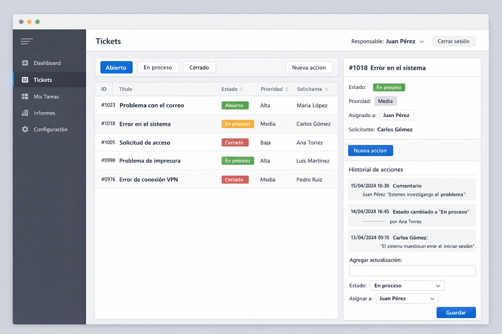

# Especificacion del sitio de tickets

## Objetivo

Construir un sitio web completo para gestionar tickets de soporte usando la API ASP.NET existente del proyecto. El sitio debe permitir registrarse, iniciar sesion, listar tickets, filtrarlos por estado, crear tickets, ver el detalle de cada ticket, cambiar su estado, asignar responsable, registrar acciones y cerrar sesion.

## Referencia visual

Mockup generado para orientar la interfaz:



La imagen es una referencia de layout y estilo. Si se implementa estrictamente sobre la API actual, no deben incluirse campos que todavia no existen en el backend, como prioridad, reportes o tareas independientes, salvo que se amplie el modelo.

## Alcance funcional

### Usuarios

El sistema maneja dos tipos de usuario:

- `Cliente`: puede crear tickets y consultar el estado de sus solicitudes.
- `Interno`: puede ver tickets, asignarse o asignar responsables, cambiar estados y registrar acciones.

La API actual no aplica reglas diferentes por tipo de usuario en los endpoints. El frontend debe preparar la interfaz para ocultar o mostrar acciones segun `TipoUsuario`, pero la validacion fuerte deberia agregarse tambien en backend si se requiere seguridad real por rol.

### Autenticacion

Pantallas requeridas:

- Login.
- Registro.
- Sesion activa con boton `Cerrar sesion`.

Endpoints disponibles:

| Accion | Metodo | Ruta | Body |
|---|---:|---|---|
| Registro | `POST` | `/auth/registro` | `{ "nombre": "...", "email": "...", "password": "...", "tipo": "Cliente" }` |
| Login | `POST` | `/auth/login` | `{ "email": "...", "password": "..." }` |
| Logout | `POST` | `/auth/logout` | Requiere `Authorization: Bearer <token>` |

El token devuelto por login debe guardarse en memoria de la app o en `localStorage`. Todas las llamadas a `/tickets` deben enviar:

```http
Authorization: Bearer <token>
```

## Pantallas

### 1. Login

Contenido:

- Titulo: `Sistema de Tickets`.
- Campo email.
- Campo password.
- Boton `Ingresar`.
- Link a `Crear cuenta`.
- Mensaje de error si las credenciales son invalidas.

Criterios:

- Si login responde `200`, guardar token y redirigir a `/tickets`.
- Si login responde `401`, mostrar `Email o password incorrectos`.
- Mientras espera respuesta, deshabilitar el boton.

### 2. Registro

Contenido:

- Nombre.
- Email.
- Password.
- Tipo de usuario: `Cliente` o `Interno`.
- Boton `Registrarme`.

Criterios:

- Si registro responde `201`, redirigir a login.
- Si responde `400`, mostrar el error recibido.
- Validar campos obligatorios antes de enviar.

### 3. Tablero de tickets

Es la pantalla principal.

Layout recomendado:

- Barra superior con titulo `Tickets`, usuario actual si esta disponible y boton `Cerrar sesion`.
- Columna principal con filtros y tabla/lista de tickets.
- Panel lateral o vista de detalle para el ticket seleccionado.

Filtros:

- `Todos`.
- `Abierto`.
- `En proceso`.
- `Cerrado`.

Endpoints:

| Accion | Metodo | Ruta |
|---|---:|---|
| Listar todos | `GET` | `/tickets` |
| Filtrar por estado | `GET` | `/tickets/estado/{estado}` |
| Obtener detalle | `GET` | `/tickets/{id}` |

Estados validos:

- `Abierto`
- `EnProceso`
- `Cerrado`

Columnas o datos visibles:

- ID.
- Titulo.
- Estado.
- Fecha de creacion.
- Originado por.
- Responsable.
- Cantidad de acciones.

Criterios:

- Al entrar a la pantalla, cargar `/tickets`.
- Al seleccionar un filtro, cargar `/tickets/estado/{estado}`.
- Al hacer click en un ticket, cargar o mostrar su detalle.
- Mostrar estados con etiquetas visuales:
  - `Abierto`: azul.
  - `EnProceso`: amarillo o naranja.
  - `Cerrado`: verde o gris.

### 4. Crear ticket

Puede ser modal o pantalla `/tickets/nuevo`.

Campos:

- Titulo.
- Descripcion.
- Responsable opcional.

Endpoint:

```http
POST /tickets
Authorization: Bearer <token>
Content-Type: application/json

{
  "titulo": "La factura sale con el total mal",
  "descripcion": "El IVA se calcula sobre el monto equivocado",
  "responsableId": 2
}
```

Criterios:

- El usuario que crea el ticket sale del token actual en backend.
- El estado inicial siempre es `Abierto`.
- Al guardar correctamente, cerrar modal y refrescar la lista.
- Si falla, mostrar mensaje claro.

Limitacion actual:

- La API no tiene endpoint para listar usuarios internos. Si el formulario debe permitir elegir responsable por nombre, hace falta agregar `GET /usuarios?tipo=Interno` o precargar esa informacion de otra manera.

### 5. Detalle de ticket

Datos:

- ID.
- Titulo.
- Descripcion.
- Estado.
- Fecha de creacion.
- Originado por.
- Responsable.
- Acciones.

Acciones disponibles:

- Cambiar estado.
- Asignar responsable.
- Registrar una accion.
- Marcar accion como realizada.

Endpoint para cambiar estado:

```http
PUT /tickets/{id}/estado
Authorization: Bearer <token>
Content-Type: application/json

{
  "estado": "EnProceso"
}
```

Endpoint para asignar responsable:

```http
PUT /tickets/{id}/responsable
Authorization: Bearer <token>
Content-Type: application/json

{
  "responsableId": 1
}
```

Endpoint para registrar accion:

```http
POST /tickets/{id}/acciones
Authorization: Bearer <token>
Content-Type: application/json

{
  "descripcion": "Revise los logs del servidor",
  "fecha": "2026-07-05T10:30:00"
}
```

Endpoint para marcar accion como realizada:

```http
PUT /tickets/{ticketId}/acciones/{accionId}/realizada
Authorization: Bearer <token>
```

Criterios:

- Las acciones deben verse como historial cronologico.
- Cada accion muestra descripcion, fecha y si esta realizada.
- Si `fecha <= DateTime.Now`, backend crea la accion como realizada.
- Si una accion no esta realizada, mostrar boton `Marcar realizada`.
- Luego de cada operacion, refrescar el detalle del ticket.

## Modelo de datos usado por el frontend

### Ticket

```ts
type EstadoTicket = "Abierto" | "EnProceso" | "Cerrado";

type Ticket = {
  id: number;
  titulo: string;
  descripcion?: string | null;
  estado: EstadoTicket;
  fechaCreacion: string;
  originadoPor?: string | null;
  responsable?: string | null;
  acciones: Accion[];
};
```

### Accion

```ts
type Accion = {
  id: number;
  descripcion: string;
  fecha: string;
  realizada: boolean;
};
```

## Requisitos de interfaz

- Idioma: espanol.
- Estilo: aplicacion de gestion, clara y densa, sin hero ni landing page.
- Navegacion simple: login, registro, tickets.
- Responsive:
  - Desktop: tabla/lista a la izquierda y detalle a la derecha.
  - Mobile: lista primero; detalle abre en pantalla aparte o panel inferior.
- Feedback:
  - Loading en cargas.
  - Empty state cuando no haya tickets.
  - Mensajes de error de API.
  - Confirmacion visual al guardar cambios.

## Requisitos tecnicos sugeridos

Frontend recomendado:

- React, Vue, Svelte o HTML/JS simple. Para este proyecto educativo, una SPA simple es suficiente.
- Consumir la API con `fetch`.
- Centralizar el token y las llamadas HTTP en un modulo `api`.
- Usar rutas:
  - `/login`
  - `/registro`
  - `/tickets`
  - `/tickets/:id` si se prefiere detalle con URL propia.

Backend actual:

- ASP.NET Minimal API.
- Entity Framework Core.
- SQLite en `tickets.db`.
- Datos semilla en desarrollo.

Comando esperado para levantar backend:

```bash
dotnet run
```

## Validaciones minimas

- Login:
  - email requerido.
  - password requerido.
- Registro:
  - nombre requerido.
  - email requerido.
  - password requerido.
  - tipo requerido.
- Ticket:
  - titulo requerido.
  - descripcion opcional.
  - responsable opcional.
- Accion:
  - descripcion requerida.
  - fecha requerida.

## Mejoras necesarias en backend para un sitio mas completo

Para que el sitio sea realmente completo, conviene agregar estos endpoints:

| Metodo | Ruta | Uso |
|---|---|---|
| `GET` | `/usuarios` | Listar usuarios para elegir responsables |
| `GET` | `/usuarios/me` | Obtener usuario actual, nombre, email y tipo |
| `GET` | `/tickets/mios` | Tickets creados por el cliente actual |
| `GET` | `/tickets/asignados` | Tickets asignados al interno actual |
| `DELETE` | `/tickets/{id}` | Eliminar o cancelar ticket si corresponde |

Tambien conviene agregar reglas de autorizacion:

- Un cliente solo ve sus propios tickets.
- Un interno puede ver todos los tickets.
- Solo internos pueden asignar responsables y cambiar estado.
- Clientes pueden agregar comentarios si el dominio lo permite.

## Criterios de aceptacion generales

- Un usuario puede registrarse.
- Un usuario puede iniciar sesion.
- Un usuario autenticado puede listar tickets.
- Un usuario autenticado puede crear un ticket.
- Un usuario autenticado puede filtrar tickets por estado.
- Un usuario autenticado puede abrir el detalle de un ticket.
- Un usuario autenticado puede cambiar el estado de un ticket.
- Un usuario autenticado puede asignar responsable por ID.
- Un usuario autenticado puede registrar acciones.
- Un usuario autenticado puede marcar acciones como realizadas.
- Un usuario puede cerrar sesion y quedar sin acceso a `/tickets`.
- Si el token falta, expiro o es invalido, el frontend redirige a login.

## Prompt usado para generar el mockup

```text
Use case: ui-mockup
Asset type: web app interface mockup for a technical specification
Primary request: complete ticket support management site interface based on an ASP.NET API, showing login context, ticket dashboard, filters by state, ticket list, selected ticket detail, assignee, status controls, and action timeline
Scene/background: modern browser viewport, application screen only
Subject: Spanish-language support ticket dashboard for internal support staff
Style/medium: polished production web UI mockup, SaaS operations tool, clean and utilitarian
Composition/framing: desktop 16:9 screenshot, left sidebar navigation, top bar with user session, main ticket table, right detail panel with timeline and forms
Lighting/mood: bright neutral professional interface
Color palette: white and light gray surfaces, restrained blue accents, green and amber status badges
Text: "Tickets", "Abierto", "En proceso", "Cerrado", "Nueva accion", "Responsable", "Cerrar sesion"
Constraints: Spanish UI, no brand logos, no watermark, no decorative illustration, text must be legible enough for a mockup
```
