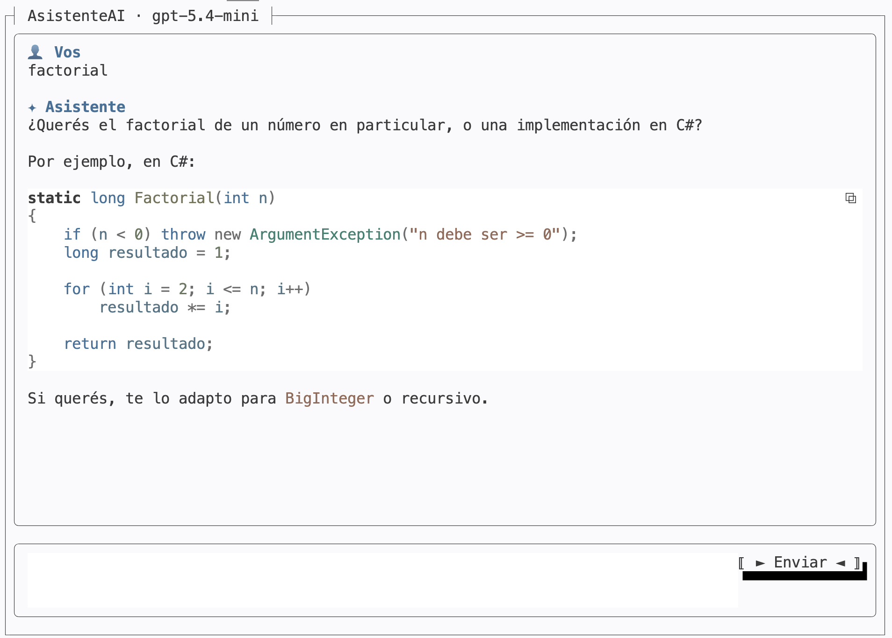

# TP6: AsistenteIA
## Asistente de Chat por Terminal con Microsoft.Extensions.AI y Terminal.Gui

> [!IMPORTANT]
> Plazo para entregar el TP6: **Jueves 25 de Junio hasta las 23:59hs**
>
> *El trabajo es estrictamente individual y debe ser realizado en persona por el alumno*

## Descripción general

Desarrollar una aplicación de **consola interactiva** que funcione como un **asistente conversacional** apoyado en un modelo de lenguaje, construida con:

- **Terminal.Gui (v2)** — Interfaz de usuario en modo texto (TUI).
- **Microsoft.Extensions.AI (MEAI)** — Abstracción `IChatClient` para conversar con el modelo.
- **Proveedor compatible con OpenAI** — Acceso al modelo mediante una clave configurada por variable de entorno.

El sistema debe permitir mantener una conversación con el asistente: el usuario escribe un mensaje, lo envía, y la respuesta del modelo se va mostrando **a medida que se genera** (streaming). La conversación se conserva durante toda la sesión para dar contexto a cada nueva pregunta.

---

## Modelo de la conversación

La conversación es una secuencia de mensajes, cada uno con un **rol** que lo distingue dentro del diálogo. Los roles que intervienen son:

| Rol         | Descripción                                                                 | Visible al usuario |
|-------------|-----------------------------------------------------------------------------|:------------------:|
| Sistema     | Instrucción inicial que define el comportamiento del asistente              | No                 |
| Usuario     | Cada mensaje que escribe la persona                                         | Sí                 |
| Asistente   | Cada respuesta que produce el modelo                                        | Sí                 |

El mensaje de **sistema** se carga desde un archivo `AGENTS.md` ubicado junto a la aplicación, y fija el "carácter" del asistente (idioma, tono, preferencias de lenguaje de ejemplo, qué hacer cuando falta contexto). Mantener el prompt en un archivo aparte permite ajustarlo sin recompilar. Los mensajes de **usuario** y **asistente** se acumulan a lo largo de la sesión y se envían completos en cada consulta, de modo que el modelo recuerde lo conversado.

El acceso al modelo se realiza mediante la abstracción `IChatClient` de **Microsoft.Extensions.AI**, sin acoplar la lógica de la aplicación a un proveedor concreto. La clave de la API se lee desde una **variable de entorno** (por ejemplo, cargada desde un archivo `.env`), nunca escrita en el código.

---

## Funcionalidades requeridas

La aplicación debe implementar la conversación con el asistente:

- **Enviar mensaje:** tomar el texto que escribió el usuario y agregarlo a la conversación.
- **Recibir respuesta en streaming:** mostrar la respuesta del modelo **fragmento a fragmento**, a medida que llega, sin esperar a que termine.
- **Mantener contexto:** conservar el historial completo de la sesión para que cada nueva pregunta tenga en cuenta lo anterior.
- **Renderizar Markdown:** mostrar la conversación con formato (encabezados por turno, bloques de código resaltados, etc.).
- **Salir:** cerrar la aplicación de forma limpia con la tecla **Esc**.

---

## Herramientas (function calling)

El asistente debe poder **operar sobre el sistema de archivos** del proyecto a pedido del usuario. Para ello se exponen al modelo, mediante el mecanismo de *function calling* de **Microsoft.Extensions.AI**, las siguientes herramientas:

| Herramienta        | Descripción                                              | Parámetros            |
|--------------------|----------------------------------------------------------|-----------------------|
| `leer-archivo`     | Devuelve el contenido de un archivo de texto             | ruta del archivo      |
| `escribir-archivo` | Crea o sobrescribe un archivo con el contenido indicado  | ruta y contenido      |
| `listar-archivos`  | Lista los archivos (y carpetas) de un directorio         | ruta del directorio   |

El modelo decide **cuándo** invocar cada herramienta a partir de lo que pide el usuario (por ejemplo: "leé `notas.txt`", "guardá esto en `salida.md`", "qué archivos hay en esta carpeta"). La aplicación debe ejecutar la función solicitada y devolver el resultado al modelo para que continúe la respuesta.

Las herramientas se definen como funciones de C# (con `AIFunctionFactory`) y se entregan al cliente a través de las `ChatOptions`, habilitando la invocación automática de funciones en el `IChatClient`.

---

## Diseño de interfaz

La interfaz debe organizarse en una ventana de pantalla completa, dividida en dos zonas verticales:

- **Panel de conversación:** ocupa la mayor parte de la pantalla y muestra el historial del diálogo. Debe poder desplazarse (scroll) con mouse y teclado para releer mensajes anteriores.
- **Panel de entrada:** un campo de texto donde el usuario escribe su mensaje, acompañado de un botón **Enviar**.

La experiencia de teclado esperada es:

- **Enter** envía el mensaje.
- **Esc** cierra la aplicación.

Mientras el asistente responde, la entrada y el botón deben deshabilitarse para evitar envíos superpuestos, y el panel de conversación debe acompañar la respuesta que se genera (auto-scroll), respetando el desplazamiento manual del usuario si éste decide leer hacia arriba.

El diseño no necesita ser visualmente complejo, pero debe ser claro, ordenado y funcional.

---

## Organización del proyecto

La solución debe separar responsabilidades de forma clara, con una estructura comprensible y mantenible. Se espera una separación razonable entre:

- Configuración y arranque (lectura de la clave, creación del `IChatClient`).
- La ventana principal y su disposición de paneles.
- El control de entrada de texto.
- El modelo de los mensajes que se muestran en pantalla.
- Las herramientas de archivos expuestas al modelo (`leer-archivo`, `escribir-archivo`, `listar-archivos`).
- La lógica de envío, streaming y actualización del historial.

La estructura concreta queda a criterio del estudiante.

 
---

## Cómo comenzar el desarrollo

El proyecto se entrega como un punto de partida mínimo que ya incluye:

- Un archivo ejecutable de **C# (file-based app)** con los paquetes necesarios declarados (`Microsoft.Extensions.AI`, `Terminal.Gui`, carga de `.env`).
- La lectura de la **clave de API** desde la variable de entorno y la creación del cliente `IChatClient`.
- Una **ventana base** de Terminal.Gui que abre a pantalla completa con el título del asistente.
- El archivo **`AGENTS.md`** con el mensaje de sistema, que la aplicación carga al iniciar.
- Copiar .env.example a .env y configurar la clave de API.

Se recomienda avanzar de a poco, verificando el funcionamiento de cada parte antes de continuar con la siguiente.
